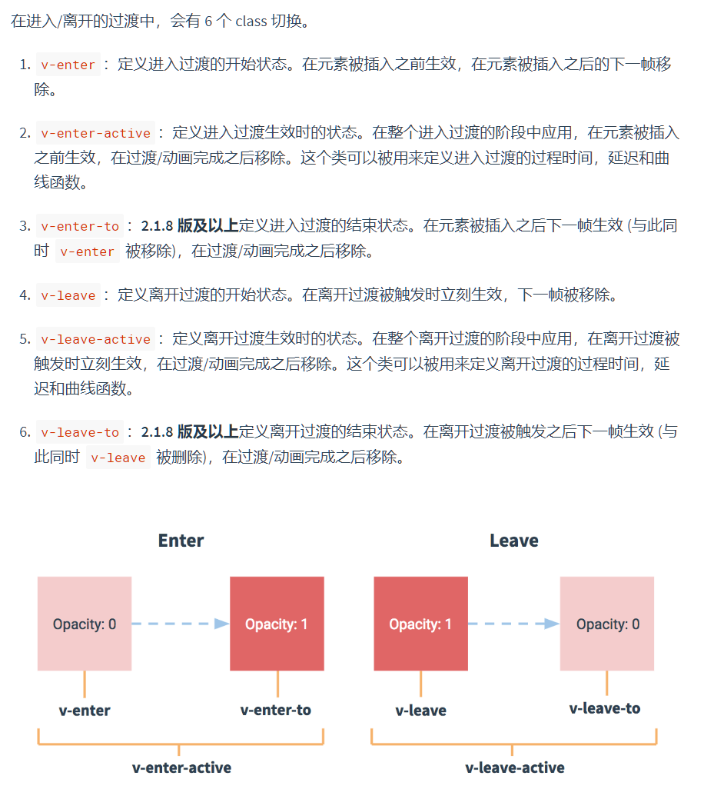

# Mall_Vue
仿New_bee-Mall的Vue端

2020年8月18日20点54分

开始前端页面的搭建，用到的技术：
1. Router
2. Vuex
3. lib-flexible # 移动端分配率适配-rem插件，
4. postcss-pxtorem，将前端的px转换成rem计算插件，需要单独一个.postcssrc.js文件来定义一下
5. VantUi前端vue组件库
6. axios前端发送请求的一个库
- [x] 页面之间的过渡效果

2020年8月23日16点04分：

Description：后台的轮播图管理，用户管理，基本开发完毕，接着就是前端的一些展示啦，加油！

- [x] 前端轮播图展示
  - [x] 获取后端数据
  - [x] 前端展示

2020年8月26日21点50分：

&nbsp; &nbsp; 从25号开始自己的身体就有点不舒服，嗓子肿的老大了哎~，难受啊，这几天几乎啥都没写，  
净搞了点乱七八糟的东东，jdk多版本管理，gitbash，简单的linux命令，然后还存了一堆问题没解决，也没mark，  
趁着难受赶紧来mark一下，免得以后又忘了。

1. vue.js引入第三方在线js
   1. 找index.html文件,在head标签中去引入在线的js
2. vue中过渡标签使用
   1. vue中的过渡效果需要借助六个Class来实现分别都是哪几个，各自的执行时机是啥时候？  
   
3. CSS中的will-change属性有什么作用？过渡、动画是如何使用的呢？
4. less语法的学习，less和sass的区别是啥？
5. vue项目打包之后是怎样的？为什么说有些代码在打包之后就不能运行了？webpack是如何打包的？
6. 按需加载和全部加载的区别是啥？
7. 如何做到响应式布局开发，盒子的尺寸是如何进行转换的？
8. vuex的应用，vuex的原理是啥？vuex和store的区别是啥？
9. [前端验证时你必须知道的session、cookie、token的发展史](https://zhuanlan.zhihu.com/p/63061864)
10. [首页开发时遇到的文字截断问题,解决方法](https://juejin.im/post/6844903795659390983)
11. [token在客户端的存储位置是localStorage,这是为什么呢？存在cookie中不可以吗？](https://blog.csdn.net/weixin_42614080/article/details/90706499)
12. [Vue中子组件的样式覆盖问题](https://www.cnblogs.com/webARM/p/12443518.html)